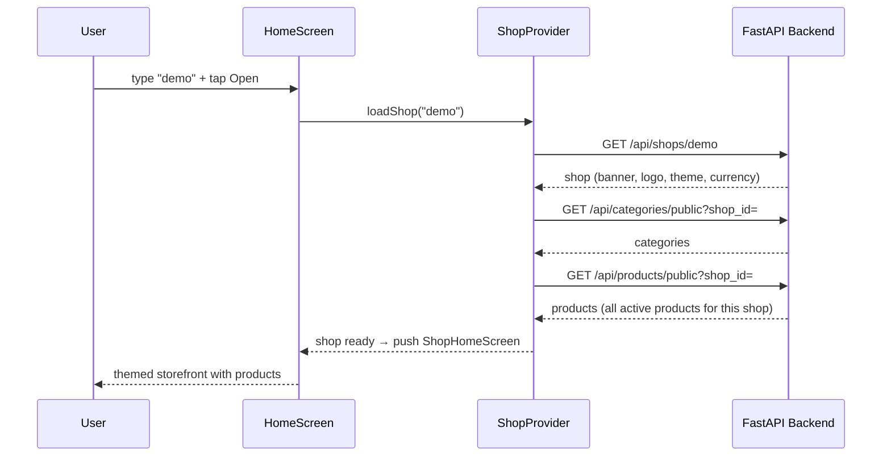
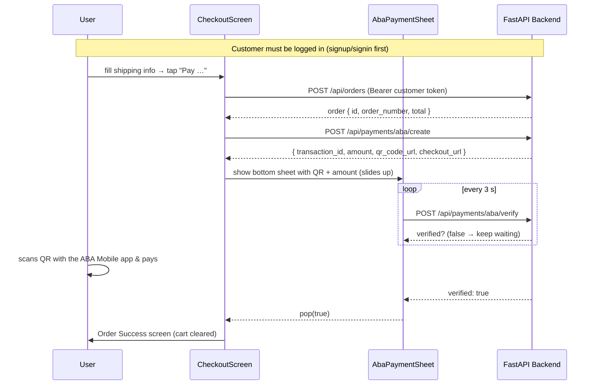
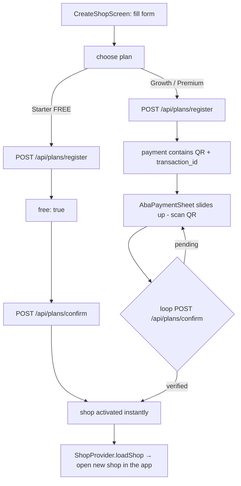
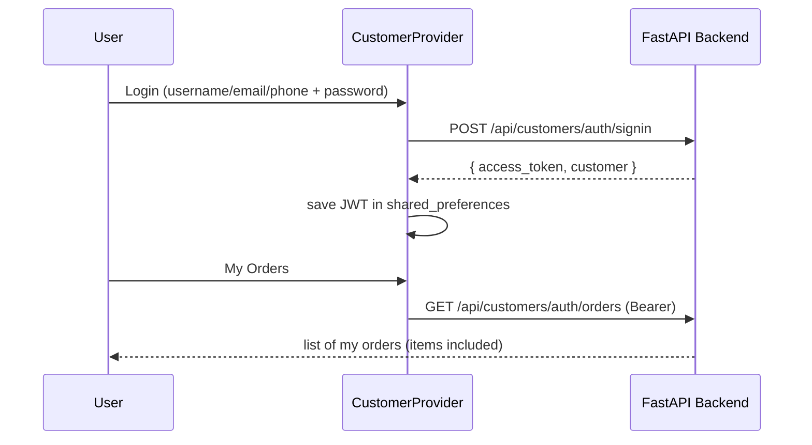

# 📱 Frontend_Mobile_APP — MiniShop Cambodia (Flutter)

> The **mobile storefront** for the MiniShop Cambodia e-commerce platform.
> Built with **Flutter (Dart)**, it mirrors the web `Frontend_User` storefront
> and talks to the **same FastAPI backend** (`Backend_API`).
>
> 💡 This folder is **100% code** — no production data, no secrets. All examples
> use `localhost`; point the app at any backend with `--dart-define`.

---

## 📋 Contents
- [What this app does](#-what-this-app-does)
- [Every screen explained](#-every-screen-explained)
- [App flows](#-app-flows)
- [Tech stack](#-tech-stack)
- [Project structure](#-project-structure)
- [Data model ↔ API mapping](#-data-model--api-mapping)
- [API endpoints used](#-api-endpoints-used)
- [Getting started](#-getting-started)
- [Testing](#-testing)
- [Release builds (APK / iOS / Web)](#-release-builds)
- [Troubleshooting & FAQ](#-troubleshooting--faq)
- [Ideas to continue building](#-ideas-to-continue-building)
- [License & credit](#-license--credit)

---

## ✨ What this app does

| # | Feature | How it works |
|---|---|---|
| 1 | 🔍 **Open any shop by username** | `GET /api/shops/{username}` — every shop on the platform has its own storefront |
| 2 | 🏪 **Shop home** | Banner, logo, **shop theme colors** (`theme.primary` / `secondary`), bio, categories, featured + all products |
| 3 | 🗂️ **Categories** | Horizontal filter chips — `GET /api/categories/public?shop_id=` |
| 4 | 🛒 **Product catalog** | Grid + search + sort (newest / price ↑↓) — `GET /api/products/public` |
| 5 | 📦 **Product detail** | Image gallery, sale badge (−%), description, **variations selector**, quantity stepper |
| 6 | 🧺 **Cart** | Add / remove / qty steppers / live subtotal — stored in memory (Provider) |
| 7 | 👤 **Customer account** | Sign up / sign in (username, email **or** phone + password) → JWT saved with `shared_preferences` |
| 8 | 🛍️ **Checkout** | Shipping form → order → **ABA QR payment sheet slides up** → auto-verify → success |
| 9 | 🔳 **ABA Pay (KHQR) payment** | QR image + amount + transaction id in a bottom sheet; polls every 3 s |
| 10 | 📦 **My Orders** | Order history with expandable items — `GET /api/customers/auth/orders` |
| 11 | 🔎 **Track order** | By order number — `GET /api/orders/public/track` |
| 12 | 🚀 **Create your own shop** | Self-serve registration inside the app (FREE starter plan; paid plans pay by QR) |
| 13 | 🌗 **Dark / Light mode** | App-wide toggle, shop-theme aware |
| 14 | 🎨 **Shop theme colors** | The app re-colors itself from each shop's `theme.primary` / `secondary` |

---

## 📱 Every screen explained

| Screen | File | What the user sees / does |
|---|---|---|
| Splash | `screens/splash_screen.dart` | Branded logo, then auto-navigates Home |
| Home | `screens/home_screen.dart` | Hero banner, **shop search box** (try `demo`), quick actions (**Create your shop**, **Track order**), plans & pricing list from the API, dark-mode toggle |
| Create Shop | `screens/create_shop_screen.dart` | Form (username, shop name, email, phone, password, referral code) + **plan picker** (Starter FREE / Growth / Premium). FREE activates instantly; paid opens the QR sheet |
| Shop Home | `screens/shop_home_screen.dart` | The shop shell with 4 bottom tabs + cart badge in the app bar |
| — Shop tab | (same file) | Banner/logo/theme, category chips, **Featured ⭐** carousel, all products grid |
| Products | `screens/products_screen.dart` | Search field, category chips, sort menu, 2-column product grid |
| Product Detail | `screens/product_detail_screen.dart` | Swipeable image gallery, sale %, options (variations), quantity stepper, **Add to cart** / **Buy now** |
| Cart | `screens/cart_screen.dart` | Items with images, variation text, qty steppers, totals bar, **Checkout →** |
| Checkout | `screens/checkout_screen.dart` | Requires **customer login** (embedded auth), shipping form (prefilled from profile), order summary, **Pay** button → ABA QR sheet |
| ABA Payment sheet | `widgets/aba_payment_sheet.dart` | Slides up from the bottom: amount, **QR to scan with the ABA app**, transaction id, live "waiting…", **Open ABA Pay** button, "I will pay later" |
| Order Success | `screens/order_success_screen.dart` | ✓ Order number + total; paid or pending message; "Back to shop" |
| My Orders | `screens/my_orders_screen.dart` | Login screen (if not logged in) or expandable order list with item rows |
| Customer Auth | `screens/customer_auth_screen.dart` | **Login / Sign up** segmented control (embedded mode used by Checkout & My Orders) |
| Profile | `screens/profile_screen.dart` | Avatar, name/@username, phone/email/telegram/address, My Orders, Logout |

## 🔄 App flows

### 1. Open a shop + browse



### 2. Checkout + ABA QR payment (bottom sheet slides up)



### 3. Create your own shop (FREE vs paid plans)



### 4. Customer account & orders



## 🧰 Tech stack

| Concern | Choice | Why |
|---|---|---|
| Language / UI | **Flutter 3.27+ (Dart)** + Material 3 | Single codebase for Android + iOS + Web |
| State management | **Provider** (`ChangeNotifier`) | Simple, built into Flutter, easy to follow |
| Networking | **`http`** + a small `ApiClient` wrapper | JSON, Bearer tokens, FastAPI `detail` error flattening |
| Local storage | **`shared_preferences`** | Persist the customer JWT across restarts |
| Deep links / browser | **`url_launcher`** | Opens the ABA Pay checkout URL / external links |
| Formatting | **`intl`** | Currency + date formatting (KHR/USD aware) |
| Images | `Image.network` with error placeholders | Product images served by the backend `/uploads` |

---

## 🏗️ Project structure

```
Frontend_Mobile_APP/
├── pubspec.yaml                  # Dependencies (http, provider, shared_preferences…)
├── analysis_options.yaml         # Lints (flutter_lints)
├── web/                          # Web platform files (flutter create)
├── test/
│   └── cart_test.dart            # Unit tests for CartProvider (flutter test)
└── lib/
    ├── main.dart                 # App entry: providers + MaterialApp + shop-theme wiring
    ├── config.dart               # AppConfig.apiBaseUrl / storeUrl (--dart-define)
    │
    ├── models/                   # Plain Dart classes parsed from the API JSON
    │   ├── shop.dart             #   Shop (banner, logo, theme, currency, payment_configured)
    │   ├── category.dart         #   Category
    │   ├── product.dart          #   Product (price/sale_price, images, variations, featured)
    │   ├── customer.dart         #   Customer (profile)
    │   ├── order.dart            #   Order + OrderItem
    │   ├── plan.dart             #   Plan (starter/growth/premium + free offer)
    │   └── cart_item.dart        #   CartItem (product + qty + selected variations)
    │
    ├── services/                 # Every HTTP call lives here
    │   ├── api_client.dart       #   http wrapper + token + error normalization
    │   ├── shop_service.dart     #   getShop · getCategories · getPlans · registerShop · confirmPlan
    │   ├── product_service.dart  #   getProducts · getProduct
    │   ├── customer_service.dart #   signup · signin · me · updateMe · myOrders
    │   └── order_service.dart    #   createOrder · createPayment · verifyPayment · trackOrder
    │
    ├── providers/                # State that the UI watches
    │   ├── shop_provider.dart    #   Shop, categories, products for the open shop
    │   ├── cart_provider.dart    #   Cart items + totals
    │   ├── customer_provider.dart#   Login/logout + persisted JWT
    │   └── theme_provider.dart   #   Dark/light + ShopTheme builder from shop colors
    │
    ├── screens/                  # One file per screen (see "Every screen explained")
    │   ├── splash_screen.dart
    │   ├── home_screen.dart
    │   ├── create_shop_screen.dart
    │   ├── shop_home_screen.dart
    │   ├── products_screen.dart
    │   ├── product_detail_screen.dart
    │   ├── cart_screen.dart
    │   ├── checkout_screen.dart
    │   ├── order_success_screen.dart
    │   ├── my_orders_screen.dart
    │   ├── customer_auth_screen.dart
    │   └── profile_screen.dart
    │
    └── widgets/                  # Reusable UI
        ├── product_card.dart     #   Grid product card
        ├── category_chip.dart    #   Horizontal filter chip
        ├── shop_header.dart      #   Banner + logo + bio
        ├── qty_stepper.dart      #   − n +
        ├── loading_view.dart     #   Spinner + error/retry
        └── aba_payment_sheet.dart#   QR payment bottom sheet (slides up, polls every 3 s)
```

## 🧩 Data model ↔ API mapping

Every Flutter model is parsed from the backend's JSON (the backend uses
`Shop.to_dict()`, `Product.to_dict()`, … so field names match 1:1).

| Flutter model | Backend JSON source | Key fields |
|---|---|---|
| `Shop` | `GET /api/shops/{username}` | `id`, `username`, `shop_name`, `logo`, `banner`, `bio`, `slideshow[]`, `theme{primary,secondary}`, `currency`, `status`, `payment_configured` |
| `Category` | `GET /api/categories/public` | `id`, `shop_id`, `name`, `slug`, `parent_id`, `image`, `sort_order` |
| `Product` | `GET /api/products/public` · `/products/{id}/public` | `id`, `name`, `price`, `sale_price`, `quantity`, `images[]`, `custom_attributes[]`, `variations[]`, `featured`, `category_name` |
| `Customer` | `POST /api/customers/auth/signin` (inside `customer`) | `id`, `shop_id`, `name`, `username`, `phone`, `email`, `telegram`, `address`, `city`, `country` |
| `Order` + `OrderItem` | `POST /api/orders` · `/customers/auth/orders` | `id`, `order_number`, `total`, `currency`, `payment_status`, `order_status`, `items[]{product_name, price, quantity, variations}` |
| `Plan` | `GET /api/plans` | `id`, `name`, `price`, `days`, `max_products`, `max_categories`, `free`, `offer_ends` |
| `CartItem` | local (built from `Product` + qty) | `product`, `quantity`, `variations` |

---

## 🔌 API endpoints used by this app

> All examples are against the **local** backend at `http://localhost:8000`.
> Interactive docs: http://localhost:8000/docs

### Public / browsing
| Method | Endpoint | Used by |
|---|---|---|
| GET | `/api/shops/{username}` | Home → open a shop |
| GET | `/api/categories/public?shop_id=` | Shop home categories |
| GET | `/api/products/public?shop_id=&category_id=&search=&sort=&featured_only=` | Product grids + search + sort |
| GET | `/api/products/{id}/public` | Product detail |
| GET | `/api/plans` | Home + CreateShop plan picker |
| GET | `/api/orders/public/track?order_number=` | Track order dialog |

### Customer account
| Method | Endpoint | Used by |
|---|---|---|
| POST | `/api/customers/auth/signup` | Create account (returns `access_token`) |
| POST | `/api/customers/auth/signin` | Login — identifier can be **username, email or phone** |
| GET | `/api/customers/auth/me` | Restore session on app start |
| PUT | `/api/customers/auth/me` | Update profile (ready for future use) |
| GET | `/api/customers/auth/orders` | My Orders (Bearer token) |

### Checkout & payment
| Method | Endpoint | Used by |
|---|---|---|
| POST | `/api/orders` | Create the order — **requires the customer Bearer token** |
| POST | `/api/payments/aba/create` | Get `{transaction_id, qr_code_url, checkout_url, amount}` |
| POST | `/api/payments/aba/verify` | Polled every 3 s by the QR payment sheet |

### Self-serve shop creation
| Method | Endpoint | Used by |
|---|---|---|
| POST | `/api/plans/register` | Create shop + owner + plan order; returns `payment` for paid plans |
| POST | `/api/plans/confirm` | FREE plan activation **and** paid-plan verify+activate (polled every 3 s) |

### Example: creating a paid-plan order (Growth) and paying

```http
POST http://localhost:8000/api/plans/register
Content-Type: application/json

{
  "username": "myshop",
  "shop_name": "My Shop",
  "email": "me@example.com",
  "phone": "012345678",
  "password": "secret123",
  "plan": "growth",
  "currency": "USD",
  "referral_code": ""
}
```

```json
// 200 OK (abridged)
{
  "shop_id": 2,
  "username": "myshop",
  "plan": { "id": "growth", "name": "Growth", "price": 55.99, "days": 180 },
  "amount": 55.99,
  "order_id": 14,
  "free": false,
  "payment": {
    "transaction_id": "MS14xxxx",
    "amount": "55.99",
    "checkout_url": "https://checkout.payway.com.kh/...",
    "qr_code_url": "/uploads/qr/qr_MS14xxxx.png"
  }
}
```

The app shows the QR sheet from `payment`, then polls:

```http
POST http://localhost:8000/api/plans/confirm
Content-Type: application/json

{ "order_id": 14, "shop_id": 2, "transaction_id": "MS14xxxx" }
```

→ returns `{ "ok": true, "verified": true, "shop": { … } }` once paid, and the
app opens the brand-new shop.

## 🚀 Getting started

### 0. Prerequisites
- **Flutter SDK 3.27+** → https://docs.flutter.dev/get-started/install
- The **FastAPI backend** running on port `8000` (see the root README → Quick Start)
- (Web only) **Chrome**
- (Android only) Android SDK / emulator — run `flutter doctor` to check

### 1. Start the backend (local)

```bash
cd Backend_API
venv\Scripts\activate          # or: source venv/bin/activate
cp .env.example .env           # optional: customise
uvicorn main:app --reload --port 8000
```

Verify: http://localhost:8000/docs should load the API docs.

### 2. Install dependencies & run the app

```bash
cd Frontend_Mobile_APP
flutter pub get

# ▶️ Web (fastest way to try it):
flutter run -d chrome

# ▶️ Android emulator (backend on your host machine):
flutter run -d emulator-5554 --dart-define=API_URL=http://10.0.2.2:8000

# ▶️ Android physical device (same Wi-Fi as the backend):
#    1) find your computer's LAN IP:  ipconfig
#    2) run:  flutter run --dart-define=API_URL=http://192.168.1.10:8000

# ▶️ iOS simulator (macOS only):
flutter run -d iPhone --dart-define=API_URL=http://localhost:8000
```

### 3. Try the full flow
1. **Home** shows plans loaded from the API
2. Search **`demo`** → open the demo shop (products, categories, theme colors)
3. Tap a product → **Add to cart** → **Buy now**
4. **Checkout** → login/sign up as a customer → fill shipping → **Pay** →
   the **ABA QR sheet slides up** (scan it with the ABA app in a real shop;
   in sandbox the flow auto-completes when the gateway approves)
5. **Create your shop** → pick **Growth/Premium** → the QR sheet appears with the plan amount
6. Pull-to-refresh, dark mode, My Orders, track order — all included

---

## ⚙️ Configuration (`--dart-define`)

The app never hard-codes a server URL in behavior — everything is configurable
at build/run time:

| Variable | Default | What it does |
|---|---|---|
| `API_URL` | `http://localhost:8000` | Base URL of the FastAPI backend |
| `STORE_URL` | `http://localhost:3000` | Storefront URL (used by referral links) |

Examples:

```bash
# Deployed backend (replace with your own URL):
flutter run --dart-define=API_URL=https://your-api.onrender.com

# Android emulator:
flutter run --dart-define=API_URL=http://10.0.2.2:8000
```

> See `lib/config.dart` — `AppConfig.apiBaseUrl` reads `String.fromEnvironment('API_URL')`.

---

## 🌐 CORS note (web only)

When you run the app **as a web app in Chrome** and point it at a **remote**
backend, the browser blocks the requests unless that backend's `CORS_ORIGINS`
includes your origin (e.g. `http://localhost:8080`). Add it to the backend's
environment (`CORS_ORIGINS` env var) and restart.

**Native Android/iOS apps are not restricted by CORS** — a phone build talks to
any backend directly, which is the recommended way to use this app in production.

## 🧪 Testing

```bash
cd Frontend_Mobile_APP

# Static analysis (lints)
flutter analyze

# Run the unit tests
flutter test
```

Tests live in `test/`:
- `cart_test.dart` — CartProvider logic: add/merge/increment/decrement/remove/clear + totals.

---

## 📦 Release builds

```bash
cd Frontend_Mobile_APP

# Android APK (install on any Android phone):
flutter build apk --release
#   → build/app/outputs/flutter-apk/app-release.apk

# Android App Bundle (for the Play Store):
flutter build appbundle --release

# iOS (macOS + Xcode only):
flutter build ipa

# Web (static files you can host anywhere):
flutter build web --release
#   → build/web/  (serve with any static host, e.g. Netlify / GitHub Pages)
```

> ⚠️ Build with the right API URL for your target:
> `flutter build apk --dart-define=API_URL=http://192.168.1.10:8000`
> (your LAN IP for local testing, or your deployed backend URL in production).

---

## ❓ Troubleshooting & FAQ

**Q: The app builds but shows "Shop not found or unavailable".**
→ The backend is not running, the shop doesn't exist, or the shop is suspended /
expired. Check `http://localhost:8000/api/shops/demo`.

**Q: Requests fail only in Chrome (but work on Android).**
→ That is **CORS**. Add your origin (e.g. `http://localhost:8080`) to the
backend's `CORS_ORIGINS` env var and restart, or use a native build.

**Q: Checkout asks me to login even though I already did.**
→ The customer session belongs to **one shop** (`shop_id` in the token). Log in
again inside the shop you are buying from — exactly like the web storefront.

**Q: The QR payment sheet says "QR unavailable".**
→ The shop (checkout) or the platform merchant shop (create-shop) has **no ABA
Pay Profile ID / Secret Key** configured yet. The "Open ABA Pay" button is the
fallback; configure the shop's Payment Settings in its dashboard.

**Q: "Payment not confirmed yet" after ~3 minutes.**
→ The sheet polls for ~3 minutes, then lets you close. Open My Orders later —
payment is verified server-side; the order still appears.

**Q: `flutter run` is slow the first time.**
→ The first build downloads artifacts and compiles. Subsequent runs are fast.

---

## 💡 Ideas to continue building

- 📸 Camera **QR scanner** inside the app instead of the ABA app
- 🗺️ **Map view** of shops near me (geolocation)
- 💬 Real-time order status via WebSockets / push notifications
- 🧾 Download the **PDF receipt** from the order (`receipt_url`)
- 💸 Reseller sign-up + commission tracking screen
- 🌍 Full Khmer/English **localization** (`flutter_localizations`)
- 🛡️ Biometric login (Face ID / fingerprint)

---

## 📄 License & credit

This mobile app is part of the **MiniShop Cambodia** platform — see the root
README for the project license, usage policy and the developer credit.

> 🔐 Demo accounts shown anywhere in this repository are **local seed accounts
> only** — this folder contains **no production data and no real credentials**.


